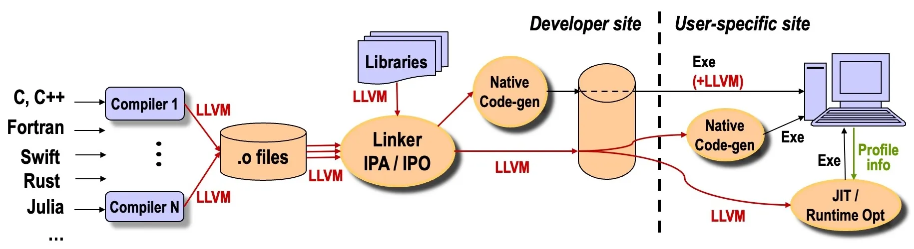

Title: The LLVM Compiler Infrastructure

URL Source: https://cacm.acm.org/federal-funding-of-academic-research/the-llvm-compiler-infrastructure/

Published Time: 2026-07-02T18:05:04Z

Markdown Content:
LLVM-generated code is used every day by billions of people on billions of devices—an outcome that can be clearly traced to research funded by the U.S. National Science Foundation (NSF) starting in the year 2000. LLVM powers the core development tools, operating systems, and most applications at Apple Computer, where it long ago replaced GCC as the foundation of the company’s software. Google uses LLVM for the Android operating system and Android NDK [native development kit]—impacting the system software on all Android devices as well. Applications that run on Qualcomm’s mobile processors (the Snapdragon family) are built in substantial part using LLVM, which further extends LLVM’s reach in the Android mobile phone industry. The two leading processor companies for personal computers and servers—ARM and Intel—abandoned their long-standing proprietary compiler systems (ARMCC and ICC) and replaced them with toolchains built on LLVM, which means that important parts of the world’s desktop and server software are compiled in part by LLVM. All of Google’s and Meta’s datacenter C/C++ code is compiled using LLVM, which means that some widely used cloud services and applications are powered in part by LLVM, such as Google Search, Facebook Feeds, Instagram, and so on. Key gaming platforms—specifically Sony’s Playstation 4 and Playstation 5 and the Nintendo Switch—use LLVM as the primary compiler toolchain for their applications. Even the rapidly growing field of AI software benefits widely from LLVM, through Nvidia’s CUDA compiler, the Triton compiler used by PyTorch and OpenAI, and even more extensively through the MLIR Compiler Infrastructure, which is also built on top of LLVM and is used by several major AI frameworks. Collectively, these outcomes imply that software products compiled using LLVM represent hundreds of billions of dollars in annual revenue across most major classes of modern computing: mobile, cloud, desktops, servers, gaming, supercomputers, and AI. It may not be an exaggeration to say that _the majority of end users across the computing industry benefit from software compiled by LLVM_.

LLVM here refers to the LLVM Compiler Infrastructure, an open source software system created to simplify the design and implementation of compilers and a wide range of compiler-based tools. LLVM (which originally expanded to _low-level virtual machine_ but is now just a name for the overall system) began in the year 2000 at the University of Illinois Urbana-Champaign (UIUC), as a joint research project of the two authors. The LLVM infrastructure was first released as open source software in October 2003 (under the liberal, three-clause University of Illinois/NCSA Open Source License, later replaced by the Apache 2.0 License with LLVM Exceptions). Since then, LLVM has evolved from an academic research project into a cornerstone of modern computing, enabling software products and technological innovations across many computing industries.

On the academic front, LLVM has also been extremely influential because it has democratized compiler projects for both teaching and research. The LLVM infrastructure is routinely used by a wide range of undergraduate and graduate compiler courses worldwide, and high-schoolers use LLVM to do programming language projects for “fun!” LLVM is also used in research projects spanning many areas, including compilers, computer architecture, software engineering, software security, hardware/FPGA synthesis, accelerator design, parallel computing, formal verification, and even quantum computing.

Another critical dimension of LLVM’s impact is on widely used open source software platforms, including popular programming languages and other software. LLVM underlies several widely used programming languages, including Swift (the dominant language for iOS mobile apps), Rust (for system- and other low-level software), Julia (for high-performance computing), Halide (for high-performance image processing used in highly popular worldwide services, such as YouTube, Flickr, and Adobe products), and Mojo (AI models at Modular Inc.). These arguably would never have happened without an easy-to-target back end and a highly flexible and modular compiler architecture.

LLVM is the foundation of Clang, the C/C++/Objective C/Objective C++ compiler used across nearly all computer systems where LLVM is used. LLVM is used to build the popular Google Chrome browser on all its host platforms.[38](https://cacm.acm.org/federal-funding-of-academic-research/the-llvm-compiler-infrastructure/#B38) WebAssembly (WASM), the fast-growing language for running high-performance native code securely in browsers and other systems, is primarily targeted by LLVM, through the widely used Emscripten compiler toolchain.[a](https://cacm.acm.org/federal-funding-of-academic-research/the-llvm-compiler-infrastructure/#fn1) There are numerous other surprising uses of LLVM, including for OpenGL shaders in the MacOS graphics pipeline, database query optimization in PostgreSQL, image processing pipelines in Adobe After Effects, and firmware for microcontrollers.

The reasons for LLVM’s impact can be traced to the key conceptual and technology gaps that LLVM filled. In the early 2000s, when LLVM began, the major open source compiler in production use was GCC, which lacked some of the important modern compiler techniques, like Static Single Assignment (SSA) form, interprocedural link-time optimization (LTO),[27](https://cacm.acm.org/federal-funding-of-academic-research/the-llvm-compiler-infrastructure/#B27) just-in-time compilation, and a flexible and clean pass pipeline. LLVM was designed to fill all these gaps, leading it to become very widely used for academic research projects. The most technically novel aspect of LLVM was—and is—that it combines both the strong, ahead-of-time optimizing compilation capabilities of traditional high-performance, statically compiled languages and the self-contained mobile code representation and flexible just-in-time and dynamic compilation capabilities of managed languages; moreover LLVM delivers all these capabilities for essentially all languages, a feature that is unique to this day.[2](https://cacm.acm.org/federal-funding-of-academic-research/the-llvm-compiler-infrastructure/#B2),[28](https://cacm.acm.org/federal-funding-of-academic-research/the-llvm-compiler-infrastructure/#B28) Nevertheless, perhaps the most important factor in LLVM’s success was not the novel technical capabilities but rather the highly modular and reusable library architecture with well-designed interfaces and separation of concerns, in place of the monolithic structure common in open source compiler implementations.[26](https://cacm.acm.org/federal-funding-of-academic-research/the-llvm-compiler-infrastructure/#B26) This flexibility made it far easier to reuse components of LLVM in an enormous range of compiler-based projects—not just a broad variety of statically and dynamically compiled languages but going far beyond anything originally envisaged by the authors, from JITs for graphics shaders to sandboxed mobile code in Web browsers, tools for circuit design, symbolic execution engines, compilers for quantum computing, and (for many years) the mobile code representation for nearly all software apps in all Apple’s mobile devices.

This article describes the context and history of the LLVM project, the federal funding that made the project possible, key characteristics of LLVM design and software architecture and its major innovations, the broad public impact of the LLVM system, and briefly lists ongoing work to expand modern compiler technology that derive from the success of LLVM.

## History of the LLVM Project and Importance of Federal Funding

**Context.** Compilers are a lynchpin Compilers are a lynchpin technology for all of modern computing because of their primary role: translating all human-written programs to machine-executable code. The GNU Compiler Collection (GCC), one of the most impactful open source software projects in all of computing, was launched in the 1980s and soon became a foundational technology for many hardware and software systems, including all Linux systems, all Apple computers, many Google services, numerous open source software projects, and others.[20](https://cacm.acm.org/federal-funding-of-academic-research/the-llvm-compiler-infrastructure/#B20)GCC also became popular for compiler research for classical compiler problems in program optimization and code generation for imperative languages, alongside specialized research infrastructures such as the Jikes Research Virtual Machine for Java,[3](https://cacm.acm.org/federal-funding-of-academic-research/the-llvm-compiler-infrastructure/#B3) Polaris[6](https://cacm.acm.org/federal-funding-of-academic-research/the-llvm-compiler-infrastructure/#B6) and SUIF[39](https://cacm.acm.org/federal-funding-of-academic-research/the-llvm-compiler-infrastructure/#B39) for automatic parallelization, and others.

However, by the year 2000, the design of GCC was becoming outdated. GCC lagged competing compilers in multiple ways even for its primary use case of static compilation, including using C instead of modern object-oriented languages like C++ or Java, the lack of cross-module interprocedural optimization, and the initial lack of support for SSA form,[11](https://cacm.acm.org/federal-funding-of-academic-research/the-llvm-compiler-infrastructure/#B11) which first appeared only in 2005 in GCC 4.0.[b](https://cacm.acm.org/federal-funding-of-academic-research/the-llvm-compiler-infrastructure/#fn2) Perhaps more serious over the long term, the design of GCC is too monolithic and inflexible for most purposes. It was not practical to extract and reuse pieces without pulling in most of the compiler, preventing uses for load-time or JIT compilation of mobile code, embedded scripting languages, sandboxing browser extensions, and many other uses. This greatly limits GCC’s use cases for both academic research and production tools, with the exception of classical compiler-focused goals.

Research infrastructures for managed languages, like JikesRVM,[3](https://cacm.acm.org/federal-funding-of-academic-research/the-llvm-compiler-infrastructure/#B3) Mono,[5](https://cacm.acm.org/federal-funding-of-academic-research/the-llvm-compiler-infrastructure/#B5),[21](https://cacm.acm.org/federal-funding-of-academic-research/the-llvm-compiler-infrastructure/#B21) and Roslyn,[c](https://cacm.acm.org/federal-funding-of-academic-research/the-llvm-compiler-infrastructure/#fn3) were also very successful within their domain, delivering major advances in garbage collection, just-in-time compilation, and mobile code execution. However, these runtime systems impose numerous language-level semantics and restrictions, which preclude them from being used for the vast majority of other programming languages and even systems that require mobile code and load-time or JIT compilation, such as for graphics shaders, CUDA, and OpenCL.

**Research and importance of federal funding.** The first author, starting a new research program at UIUC, had the broad goal of designing flexible dynamic-compilation techniques for arbitrary programming languages, including static, dynamic, and scripting languages. His CAREER proposal to the NSF’s Next Generation Software (NGS) program, submitted in July 2000,[1](https://cacm.acm.org/federal-funding-of-academic-research/the-llvm-compiler-infrastructure/#B1) addressed techniques to make dynamic compilation efficient, powerful, and flexible, and was directly motivated by the limitations of existing runtime compilation techniques, including those in managed languages. This award would prove pivotal to the group’s early work on LLVM.

The LLVM research project began in Fall 2000, with the broad goal of designing a highly flexible compilation strategy that would support static and dynamic compilation for arbitrary programming languages. The second author joined the UIUC Ph.D. program in Fall 2000. During that semester, the authors extensively discussed designing a new compiler infrastructure that would be far more flexible than existing static and managed-language compilers, and enable both static and dynamic compilation for arbitrary languages. _Redesigning an entire compiler system from scratch is an academic luxury that enables building on state-of-the-art design techniques from the literature._ Key design goals the authors discussed included:

*   A clean, completely language- and hardware-independent intermediate representation called LLVM IR, based on partial SSA form integrated with a control flow graph (CFG) per function

*   A fully executable IR definition that could be exported and used directly as a fully self-contained program representation, with no excess language-specific baggage—i.e., _for all programming languages_—unlike the popular Java bytecode or MSIL

*   First-class support for cross-module compilation using the offline IR representation for link-time optimization (LTO) and delayed, static machine code generation

*   First-class support for just-in-time compilation, through the _same offline code representation_ and delayed, dynamic machine-code generation

*   A highly flexible compiler pass pipeline and overall compiler architecture based on strong adherence to the principle of Separation of Concerns in compiler design[4](https://cacm.acm.org/federal-funding-of-academic-research/the-llvm-compiler-infrastructure/#B4)

Many of these design principles and related papers—especially SSA form,[11](https://cacm.acm.org/federal-funding-of-academic-research/the-llvm-compiler-infrastructure/#B11) Separation of Concerns,[4](https://cacm.acm.org/federal-funding-of-academic-research/the-llvm-compiler-infrastructure/#B4) highly retargetable code generation, and interprocedural compilation—were discussed in the first author’s Advanced Compiler Construction class taught that Fall semester. Although they were well-known techniques in the compiler community, no existing compiler system we know of adopted all these principles nor used them as pervasively as LLVM did.

Perhaps the most impactful design feature of the LLVM infrastructure proved to be the highly modular library-based architecture, which in combination with the Separation of Principles compiler design, enabled a huge range of use cases, many of which were never envisaged during the early years of the research project. Some of these uses cases are described later in this article.

The detailed design and implementation of the LLVM infrastructure was begun by the second author during the winter break after the Fall 2000 semester. When he returned from the break, he already had skeleton working code that included the core principles of the LLVM design, including the highly modular library structure, a clean IR with fully equivalent in-memory, offline textual, and offline binary forms; initial tools to transform between the different IR forms; and the beginnings of a flexible pass pipeline with an elegant Separation-of-Concerns architecture. Remarkably, although the code base has changed almost completely and grown by orders of magnitude since those early days, all those initial design features are clearly visible in the architecture of LLVM today.

The direct federal funding for the LLVM research project was essential for its early development and open source distribution, and supported continued enhancements during the early years. The first author’s CAREER proposal supported both authors during most of their work on the project except for the initial year. This stage of research included the early papers on LLVM[2](https://cacm.acm.org/federal-funding-of-academic-research/the-llvm-compiler-infrastructure/#B2),[27](https://cacm.acm.org/federal-funding-of-academic-research/the-llvm-compiler-infrastructure/#B27),[29](https://cacm.acm.org/federal-funding-of-academic-research/the-llvm-compiler-infrastructure/#B29),[32](https://cacm.acm.org/federal-funding-of-academic-research/the-llvm-compiler-infrastructure/#B32) and the first release of the open source software system in December 2003. Additional funding from several other federal programs enabled us to broaden the research efforts in the LLVM project, including work on virtual instruction set architectures,[2](https://cacm.acm.org/federal-funding-of-academic-research/the-llvm-compiler-infrastructure/#B2),[7](https://cacm.acm.org/federal-funding-of-academic-research/the-llvm-compiler-infrastructure/#B7),[9](https://cacm.acm.org/federal-funding-of-academic-research/the-llvm-compiler-infrastructure/#B9),[17](https://cacm.acm.org/federal-funding-of-academic-research/the-llvm-compiler-infrastructure/#B17) interprocedural pointer analysis and optimization,[29](https://cacm.acm.org/federal-funding-of-academic-research/the-llvm-compiler-infrastructure/#B29),[30](https://cacm.acm.org/federal-funding-of-academic-research/the-llvm-compiler-infrastructure/#B30),[32](https://cacm.acm.org/federal-funding-of-academic-research/the-llvm-compiler-infrastructure/#B32) lightweight compiler-based memory safety for C programs and system software,[12](https://cacm.acm.org/federal-funding-of-academic-research/the-llvm-compiler-infrastructure/#B12),[16](https://cacm.acm.org/federal-funding-of-academic-research/the-llvm-compiler-infrastructure/#B16),[24](https://cacm.acm.org/federal-funding-of-academic-research/the-llvm-compiler-infrastructure/#B24) and a safe virtualized execution environment (SVA) for a commodity operating system (OS) kernel, such as the entire Linux kernel, to prevent security exploits on kernel code.[8](https://cacm.acm.org/federal-funding-of-academic-research/the-llvm-compiler-infrastructure/#B8)

The primary LLVM paper at CGO 2004 won a retrospective Most Influential Paper award 10 years later, and the SVA paper won an Audience Choice Paper Award in SOSP 2007. We believe the CGO 2004 paper is likely one of the most highly cited papers in the field of compilers, with _more than 8,000 citations today_. Less than nine years after its initial public release, LLVM’s worldwide impact was already high enough that the authors of LLVM were awarded the ACM Software System Award in 2012, which is given by ACM to only a single software system worldwide every year.

**Release and early adoption.** The LLVM system was first released in open source form in December 2003, under the University of Illinois/NCSA Open Source License. A major priority was to grow and support an external community of developers and users, and attract active external contributors. The second author joined Apple Computer after his Ph.D., in large part because Apple allowed him to continue working on and contributing to the open source LLVM system. His tenure at Apple was remarkably impactful in fostering commercial adoption of LLVM, both at Apple and elsewhere. Apple was largely a GCC shop at the time, with their XCode IDE and compilers for both system code and applications all compiled using GCC (for C/C++/Objective C/Objective C++). The first commercial product to adopt LLVM, in 2006, was the MacOS OpenGL graphics stack, replacing a custom JIT (which the graphics team had to write and maintain) with an LLVM-based JIT, using LLVM bytecode for shipping and distributing shaders. LLVM was soon incorporated into XCode, as well, but the big shift toward LLVM happened when Chris, with Apple’s support, developed Clang, a fully open source alternative to GCC for C/C++. Apple went on to completely replace GCC with Clang/LLVM for all its system software and applications, across all its desktop, laptop, and mobile devices. Google, ARM, Qualcomm, Sony, and many other companies soon began to adopt Clang/LLVM, as well.

## Technical Overview of the LLVM Compiler Infrastructure

LLVM is a compiler framework that aims to make lifelong program analysis and transformation available for arbitrary software. LLVM achieves this capability through two design features: a _code representation_—the LLVM IR—that serves as a common basis for analysis, transformation, _and_ code distribution; and (b) a _compilation strategy_ that exploits this representation to provide a combination of five capabilities that is not available in any other compilation system we know of:

1.   Persistent program information: A compiler built using LLVM can choose to preserve the LLVM code representation throughout an application’s lifetime, enabling sophisticated optimizations to be performed at all stages, including compile time, link time, load time, run time, and even “idle time,” that is, between runs on the end-user’s system.

2.   Offline code generation: Regardless of the choice made on persistence, it is possible to compile programs into efficient native machine code offline using powerful code-generation techniques too expensive for runtime code generation. This is crucial for performance-critical programs.

3.   User-specific profiling and optimization: The LLVM framework can gather profile data at runtime for deployed software so it is representative of the end user’s usage patterns, and then use it for profile-guided optimizations both at run-time and in idle time.

4.   Transparent runtime model: LLVM does not specify any particular object model, exception semantics, or runtime environment, so it benefits any language (or combination of languages).

5.   Uniform, whole-program compilation: Language independence makes it possible to optimize and compile all code comprising an application in a uniform manner (after linking), including language-specific runtime libraries and system libraries, and potentially even OS kernel components in carefully designed circumstances, such as a closed embedded system.

We believe _no other system to date provides all five properties_, a claim we made in the CGO 2004 paper which continues to be true today, more than 20 years later. This is obvious for most compiler alternatives. The closest in practice are high-level virtual machines for managed languages, such as JVM or .NET’s CLI: These provide #3 and partially provide #1 and #5, but do not provide #4, which greatly limits their applicability to many languages. Moreover, if these managed languages provide #2, they do it at the exclusion of #1 and #3. Other mobile-code strategies, such as GPU virtual instruction sets (CUDA’s PTX and OpenCL’s SPIR-V) and JITs for Javascript, Python, and WebAssembly provide some combination of #1 and #3 but not the rest.

**The LLVM intermediate representation.** The key reasons this novel combination of capabilities is possible lie in the design choices made in LLVM IR. The IR is designed to be a fully self-contained, executable, hardware- and language-independent _virtual instruction set architecture_[2](https://cacm.acm.org/federal-funding-of-academic-research/the-llvm-compiler-infrastructure/#B2) that is rich enough to support sophisticated compiler analyses and transformations, yet low-level enough to be language-neutral and to support _all_ compiled software, including OS, kernel, and application code. There are also some limitations of the design incurred to achieve the capabilities above.

The LLVM IR captures the key operations of ordinary processors but avoids machine-specific constraints, such as physical registers, memory-addressing modes, and low-level calling conventions. LLVM IR uses SSA form with _ϕ_ operations represented by an explicit Phi instruction. SSA form simplifies many dataflow optimizations on local variables by making the flow of values from definitions to uses explicit, and many reordering transformations by eliminating spurious antidependences and output dependencies on those variables. LLVM supports vectors as first-class values, including instruction operands and vector memory transfers, which is crucial in supporting short-SIMD instructions in modern processors, such as Intel’s SSE, AVX and VNNI, ARM Neon, and others. LLVM vector instructions can be generated by parallel language front ends (e.g., for OpenMP, Fortran, Halide, or Julia), for tensor operations in machine learning applications, or by automatic vectorization passes in LLVM based on data-dependence analysis. LLVM IR supports _intrinsic functions_, which are built-in functions with predefined semantics, as a powerful extensibility mechanism. They behave exactly like ordinary function calls so most passes can safely be unaware of them, but selected passes and code generators can recognize specific intrinsics and implement the desired semantics. This flexibility has allowed a huge range of new IR operations and language- or hardware-specific features to be supported in LLVM, many in the official releases and far more in the numerous experimental research projects that use LLVM.

The LLVM IR language has fully self-contained, executable semantics, which means complete executable programs can be represented and shipped in LLVM IR form, and can be executed via an interpreter or by translation to machine code. This feature is what makes “late-stage” compilation possible, by persisting the LLVM IR code for link-time or later compilation steps.

One price of widespread adoption is high IR complexity. LLVM IR launched in 2003 with fewer than 35 polymorphic operations; it has now grown to more than 175 (including in excess of 110 vector operations defined as intrinsics for convenience), as well as hundreds of other semantically significant intrinsics for garbage collection, memory ordering, synchronization, stack manipulation, and others. While most intrinsics can be ignored for tasks such as building language front ends, optimization passes, or back-end passes, the complexity greatly complicates efforts such as building a new back end or defining a formal semantics for LLVM.

**LLVM compiler architecture.** The figure shows a schematic depicting the major compilation flows in the LLVM infrastructure. Traditional compilers built using LLVM, such as Clang, Rustc, Flang, Juliac, and many others, are able to “export” the LLVM IR for each source file. An LLVM IR linker combines all IR modules for an application and also any of its libraries that were exported to IR modules into a unified (perhaps complete) LLVM program, and then performs interprocedural analysis and optimization on that program (LTO),[19](https://cacm.acm.org/federal-funding-of-academic-research/the-llvm-compiler-infrastructure/#B19) followed by back-end target code generation.

Schematic of LLVM compiler architecture showing static, just-in-time, and other compilation flows.

Several alternative, non-traditional compilation flows made possible by LLVM are used in production systems. Perhaps the most extensive use has been for Apple’s mobile apps, which for many years (mid-2010s through 2022) were shipped by developers to Apple’s App Store in LLVM IR form and compiled down to an end-user device in the App Store. This enabled Apple to support multiple processor architectures across their diverse device lineup, including older iPhones running 32-bit ARM processors and newer iPhones with 64-bit ARM chips, Apple Watches with specialized low-power ARM variants, and Apple TVs with their own architectural requirements. This strategy simplified mobile app development, reduced app sizes for end users, enabled easier deployment of new compiler optimizations and hardware features, and enabled more effective enforcement of API usage restrictions by analyzing explicit LLVM function calls instead of arbitrary control transfers in machine code.

Another compilation flow widely used in production is to support a variety of mobile code formats via LLVM-based load-time or run-time code generation, for example, Nvidia’s PTX, Python, or WebAssembly. LLVM greatly reduced the cost and complexity of these systems by avoiding the need for custom code generators.

None of these non-traditional compilation flows is supported by any other compiler infastructure we know, not even those with run-time compilation capabilities, such as JVM or .NET. This is because none of these systems has a sufficiently language-independent shipping code format to support (say) CUDA or WebAssembly.

## Major External Impact of LLVM

The most important and pervasive impact of LLVM to date has undoubtedly been its impact on industry products worldwide. The impact on the practice of computing is also important because it carries long-term benefits spanning industries and shows the potential for continuing changes. And the intellectual impact in terms of research and education carries even more long-term significance.

**Impact of LLVM on industry.** The economic impact of LLVM spans nearly the entire range of the computing industry: mobile, cloud, desktop, high-performance computing, gaming, and increasingly AI. The highlights were described at the outset of the Introduction; here we briefly expand on some of the key reasons—and a few of the major milestones—toward that impact.

**Mobile computing.** The most widespread impact of LLVM is in the mobile devices people use daily worldwide. Apple’s wholesale adoption of LLVM (replacing GCC) happened in stages: initially for the JIT compilers for OpenGL graphics shaders in MacOS; then in XCode for optimization and code generation; and later, the development of Clang and the Swift programming language (both designed around LLVM). For many years, Apple’s mobile apps leveraged LLVM’s “lifelong” compilation capabilities when shipped as LLVM to the Apple App Store. Android development also relies on LLVM through the Android Native Development Kit (NDK).

**Cloud computing.** To our knowledge, all of Google’s and Meta’s datacenter C/C++ code is built by LLVM. Google in particular (like Apple before them) migrated from GCC to Clang for C++ software, giving them better tooling, developer productivity, compile times, code coverage, and performance. For several years, Clang replaced GCC only in development (because of a far better developer experience) but not for shipping production code (because of slightly lagging performance). But these gaps closed over time.

**Desktop and server computing.** It is remarkable that Intel and ARM adopted LLVM because both companies have long-standing investments in proprietary compiler toolchains—ICC and ARMCC, respectively. Intel invested strongly in lifting LLVM code-generation quality on Intel processors, bringing it up to par with Intel’s compilers. Intel eventually switched its production C/C++ compiler stack to Clang and LLVM across its processor lines.[36](https://cacm.acm.org/federal-funding-of-academic-research/the-llvm-compiler-infrastructure/#B36) ARM was one of the early adopters of LLVM. Notably, ARM’s concerns about the lack of patent protections in the original LLVM license motivated a complex, multiyear effort spanning legal departments across many companies and universities to reissue LLVM under the Apache 2.0 License, which provides strong indemnity against unintentional patent infringement.

**Gaming consoles.** Sony was an early adopter of LLVM and uses Clang as the primary compiler for both PlayStation 4 and PlayStation 5 development. Nintendo made a remarkable transition from proprietary tools to LLVM-based infrastructure for the Switch.

**Artificial intelligence.** The newest frontier of LLVM’s impact comes in the field of AI. First, the CUDA-based cuDNN library is widely used by AI frameworks, including PyTorch, TensorFlow, and TVM, which creates a direct reliance on LLVM through the CUDA toolchain. Second, multi-level intermediate representation (MLIR), used in most major AI frameworks (TensorFlow’s XLA compiler, parts of PyTorch, the OpenXLA ecosystem, and even components of Nvidia’s CUDA toolkit) all use LLVM for core back-end functions, such as register allocation and scheduling. It also lowers tensor operations to LLVM IR in many compiler flows.

**Impact of LLVM on the practice of computing.** LLVM influence in the long term will derive even more from its role in the emergence of new programming languages, Web technologies, and more specialized computing domains. Rust, the systems programming language gaining rapid adoption for its memory-safety guarantees, depends entirely on LLVM for code generation across all platforms. Julia, designed for high-performance scientific computing, leverages LLVM’s just-in-time compilation capabilities to achieve performance rivaling traditional compiled languages. LLVM also enables WebAssembly, the technology that allows languages like C++, Rust, and others to run at near-native speed in Web browsers—fundamentally changing what’s possible in Web applications.

LLVM has enabled innovations in specialized computing domains that would have been prohibitively expensive to develop from scratch. The PostgreSQL database uses LLVM for just-in-time compilation of queries, dramatically improving performance for complex analytical workloads. Quantum computing companies build their programming languages and compilers on LLVM infrastructure, as do developers of hardware verification tools. Xilinx uses LLVM heavily in its FPGA compilation tool flows, and the CIRCT project is also extending MLIR into hardware design.

Beyond these high-profile applications, LLVM has enabled a remarkable diversity of specialized and often surprising use cases that showcase its versatility. These use cases span graphics optimizations, audio DSP languages and “audio shaders,” systems languages used for firmware in embedded systems, and domain-specific languages in research use from computational biology to high-energy physics. LLVM has even democratized the creation of embedded scripting languages within complex software, which often need some form of user scripting or automation: LLVM makes it trivial to transform a simple interpreter into a high-performance just-in-time compiler.

**Impact of LLVM on research and government.** LLVM’s influence extends far beyond commercial applications into the important realms of academic research and government-funded scientific computing. National laboratories, including Los Alamos, Lawrence Livermore, and Sandia, have embraced LLVM as a core technology for exascale computing. Initiatives such as “Kitsune,” a Los Alamos-led effort for the Exascale Computing Project, extends LLVM to support the massive parallel computing requirements needed for nuclear weapons simulation, climate modeling, and other computationally intensive scientific areas. The National Nuclear Security Administration has partnered with Nvidia and national laboratories to develop Flang, an open source Fortran compiler built on LLVM, explicitly stating that “Large HPC applications … require a common compiler infrastructure that supports both C/C++ and Fortran.”[25](https://cacm.acm.org/federal-funding-of-academic-research/the-llvm-compiler-infrastructure/#B25)

In academic circles, LLVM has democratized both compiler education and research. Traditional compiler courses used to build simplistic compilers mostly from scratch, with limited ability to compile realistic benchmarks like the large programs in SPEC or others. In contrast, the modularity, flexibility, and ease-of-use of LLVM enables both simple and powerful course projects to be accomplished by one or two students in a single semester. Universities worldwide now teach compiler construction courses using LLVM as the foundation, with numerous undergraduate and graduate compiler courses centered on LLVM. Remarkably, we have met multiple freshmen who as high school students had explored compiler projects using LLVM and entered college with non-trivial compiler experience, which is traditionally an advanced computer science college topic!

LLVM has lowered the barrier to compiler research even more dramatically, enabling graduate students to focus on novel compiler algorithms and compiler use cases far beyond what GCC could support. The highly flexible and modular architecture of LLVM makes it possible for a research project to develop simple new compiler passes in a day and test them on large, complex applications immediately. LLVM enables research projects to be evaluated on realistic workloads, easing transition of research results to production uses. Publications using LLVM are also regularly published in numerous other areas of computer science, not only compiler-adjacent areas such as programming languages, software engineering, formal verification, and computer architecture, but also less related areas such as computer security,[34](https://cacm.acm.org/federal-funding-of-academic-research/the-llvm-compiler-infrastructure/#B34),[37](https://cacm.acm.org/federal-funding-of-academic-research/the-llvm-compiler-infrastructure/#B37) hardware synthesis,[40](https://cacm.acm.org/federal-funding-of-academic-research/the-llvm-compiler-infrastructure/#B40) and even important compilers for quantum computing research.[22](https://cacm.acm.org/federal-funding-of-academic-research/the-llvm-compiler-infrastructure/#B22) A small fraction of the vast number of published research papers that use LLVM are listed at the LLVM website.[d](https://cacm.acm.org/federal-funding-of-academic-research/the-llvm-compiler-infrastructure/#fn4)

## Ongoing and Future Directions with LLVM

The LLVM Compiler Infrastructure continues to evolve, expand, and grow. On the research front, research projects are developing powerful new compiler capabilities. For example, the ALIVE2 project has developed formal correctness guarantees for compiler passes through translation validation using LLVM.[33](https://cacm.acm.org/federal-funding-of-academic-research/the-llvm-compiler-infrastructure/#B33) The HPVM project has developed a highly retargetable compiler system for diverse heterogeneous systems by adding a hierarchical graph representation of parallel programs, with LLVM IR as the core program representation for both static and dynamic compilation.[18](https://cacm.acm.org/federal-funding-of-academic-research/the-llvm-compiler-infrastructure/#B18) The MLIR project continues to evolve numerous compiler components (called “dialects” in MLIR parlance) for both custom hardware accelerators and diverse AI compiler systems.[31](https://cacm.acm.org/federal-funding-of-academic-research/the-llvm-compiler-infrastructure/#B31) The Hydride and MISAAL projects are showing that core compiler components can be automatically generated directly from vendor specifications of ISA functionality, including the hardware-independent LLVM IR, front-end translators, and back-end code generators for multiple hardware instruction sets. These autogenerated compilers can match or beat the performance of even a highly engineered production compiler for Halide despite requiring an order-of-magnitude less manual effort.[23](https://cacm.acm.org/federal-funding-of-academic-research/the-llvm-compiler-infrastructure/#B23),[35](https://cacm.acm.org/federal-funding-of-academic-research/the-llvm-compiler-infrastructure/#B35) And LLVM has recently been used to fine-tune the “LLM Compiler”,[10](https://cacm.acm.org/federal-funding-of-academic-research/the-llvm-compiler-infrastructure/#B10) a suite of open, pre-trained LLMs specifically designed for compiler tasks by fine-tuning CodeLlama on more than 537 billion tokens of LLVM IR and assembly code. The enormous volume of LLVM-compiled languages and open source LLVM-compiled projects makes it possible to create such a huge data corpus for training or fine-tuning LLMs successfully today.

## Conclusions

The compiler infrastructure that began in 2000 as a federally funded two-person research project at the University of Illinois now supports multi-billion dollar hardware, software, and services industries worldwide; powers some of the programming languages of the future; enables mission-critical research at national laboratories; and supports the computational foundations for ongoing scientific and AI advances. The story of LLVM illustrates how foundational infrastructure projects can have an outsize influence on technological progress. By combining novel compiler design with reusability, modularity, and community-driven development, LLVM has made software and hardware innovation easier, faster, and more accessible across most major computing sectors.

Several essential features of the LLVM project were critical to its success. First, federal funding—especially NSF’s strategy of funding early-stage blue-sky research with unknowable outcomes while encouraging open source artifacts—was essential to making the initial academic research and the infrastructure possible. Second, an academic research effort was key to identifying state-of-the-art compiler technologies and extending them with novel and powerful capabilities. Third, distributing a commercially neutral open source infrastructure with a liberal license led to it being used over and over again in pervasive commercial products across nearly all major subsectors of computing. Fourth, the widespread adoption of the system was driven by strong technical and community leadership by the second author, first at Apple for numerous products, then (through strategic community coordination) at other large companies. Finally, the breadth of adoption was augmented powerfully by derivative systems that were themselves highly successful, including Clang, Swift, and MLIR, all led by the second author. All told, a small federally funded academic research project has resulted in powerful innovations and world-changing, foundational infrastructure.

## Acknowledgments

The original research on the LLVM Compiler Infratructure project was funded by the National Science Foundation (NSF) Next Generation Software (NGS) Program, under Grant no. NSF EIA-0093426. Research on LLVM has also been supported by other NSF grants, as well as funding from the Office of Naval Research (ONR), DARPA, IARPA, DOE, and several industry sources.
